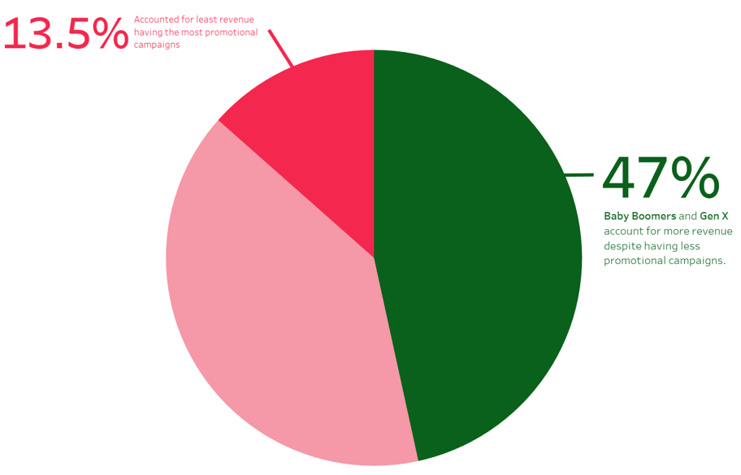
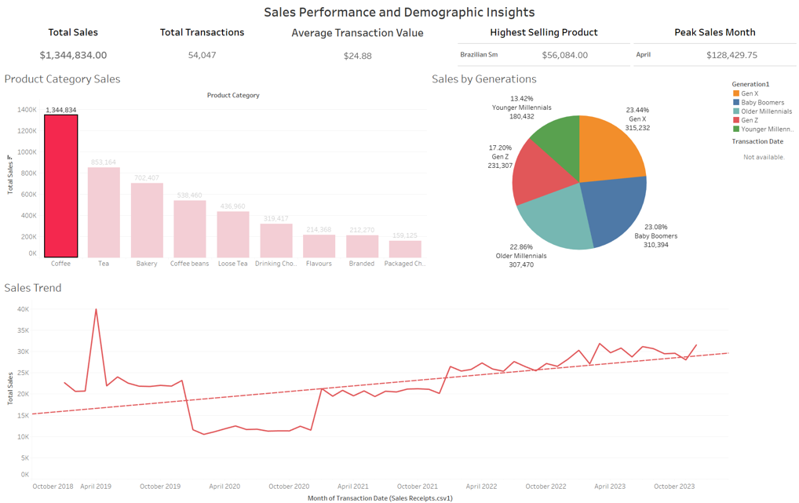
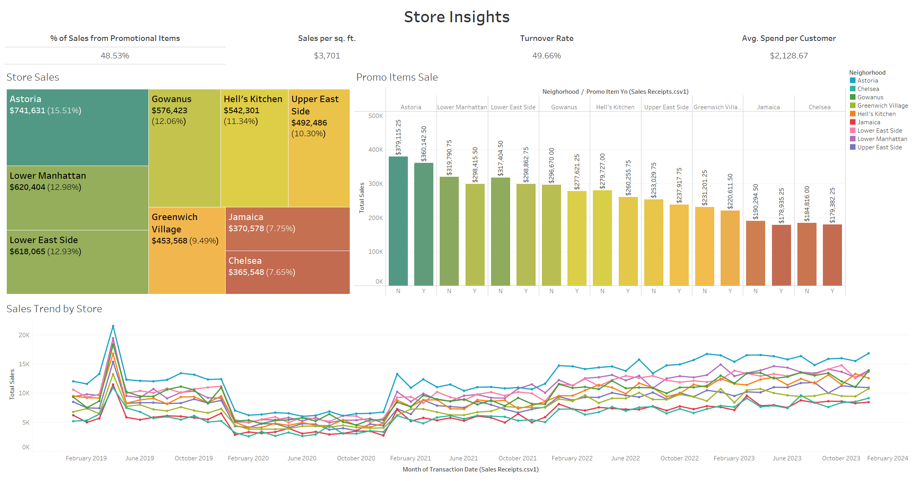

# 🛍️ Retail Analytics and Insights – Dashboard Project

This project presents a compelling analysis of retail data, built to uncover actionable insights across customer behavior, product performance, store operations, and promotional strategies. Designed as a dashboard-centric visual storytelling exercise, it demonstrates the value of data-driven decision-making in retail environments.

> 📊 Tools Used: Tableau (for data modeling & visualization) and PowerPoint (for executive delivery)

---

## 🎯 Project Objective

To help retail leaders:
- Understand customer segments and their buying behavior
- Optimize product planning based on seasonality
- Evaluate store performance and promotional effectiveness
- Turn insights into strategic retail actions

---

## 🖥️ Dashboard Previews

| Customer Demographics | Product Trends & Seasonality | Store & Promotion Insights |
|------------------------|------------------------------|-----------------------------|
|  |  |  |
| Baby Boomers and Gen X drive over 50% of revenue. | Coffee is a top seller, peaking in April. | Astoria outperforms; promotions drive 50% of sales. |

---

## 🗂️ Key Insights

### 👥 Customer Demographics
- Baby Boomers and Gen X account for the majority of revenue
- Tailored promotions to these cohorts can yield high ROI

### ☕ Product & Seasonal Trends
- Coffee generates $1.24M in sales, peaking in April
- Inventory planning should align with seasonal demand (e.g., Coffee & Bakery)

### 🏬 Store Insights & Promotions
- Astoria store drives 15% of total revenue — a potential benchmark
- Promotions influence nearly 50% of sales — but profitability needs further review

---

## 🔁 Connecting Insights to Actions

| Recommendation | Description |
|----------------|-------------|
| 🎯 Target Older Generations | Align marketing with the preferences of Baby Boomers and Gen X |
| 🧁 Expand High-Selling SKUs | Boost supply of Coffee and Bakery during spring |
| 🏪 Replicate High-Performers | Study Astoria’s operations and apply best practices |
| 📉 Promotion Analysis | Audit ROI of major campaigns to ensure sustainable margins |

---

## 📁 Files Included

- `Retail Analytics and Insights.pptx` – Presentation slides used for stakeholder delivery
- `Presentation Script.pdf` – Full narrated script accompanying each slide
- Dashboard screenshots – Uploaded PNGs showing key dashboards

---

## 🧠 Author

**Sahibnoor Chahal**  
MSBA Candidate, UMass Amherst – Isenberg School of Management  
Project focus: translating retail data into actionable insights through visualization

---

